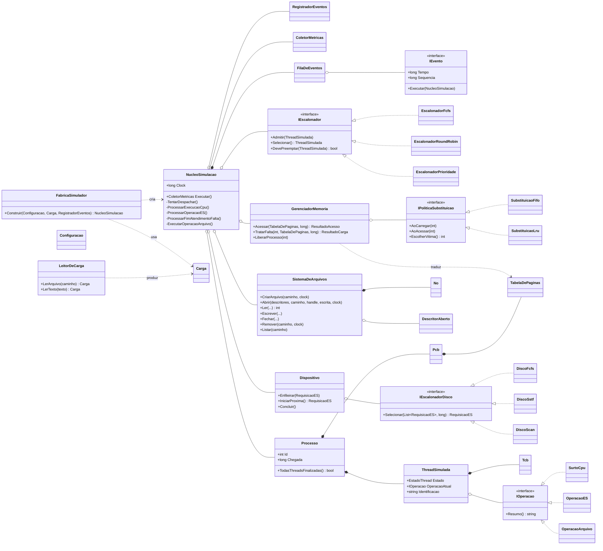

# Diagrama de Classes

O diagrama abaixo (notação Mermaid) resume as principais classes do simulador e
suas relações. Ele destaca a **separação mecanismo × política**: o
`NucleoSimulacao` depende apenas de interfaces (`IEscalonador`,
`IEscalonadorDisco`, `IPoliticaSubstituicao`), cujas implementações concretas
são escolhidas pela `FabricaSimulador`.

## Legenda das relações

- `*--` composição (o todo é dono da parte);
- `o--` agregação/associação (referência a uma parte de vida independente);
- `..>` dependência (uso pontual);
- `<|..` realização de interface.
